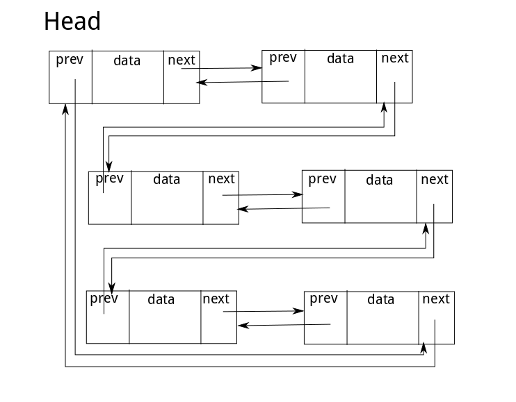

# Clist

Clist是一个纯C完成的链表库, 目前正在开发阶段

使用了C内核的链表实现方式, 无需多次定义链表结构, 使用较安全的方式进行类型转换

实现的是一个双向循环链表：

主要目的是测试C语言的通用数据结构

项目是使用cmake构建的, 需要预装cmake

当然结构十分简单, 您也可以用普通的gcc指令构建

文档使用doxygen构建

### 构建项目

1. 新建`build`文件夹
2. 在`build`文件夹下执行 `cmake ..`
3. 继续执行 `make`

### 构建文档

1. 进入`build`文件夹
2. 执行`make doc`

### 测试

在`build`文件夹下执行`./test`
